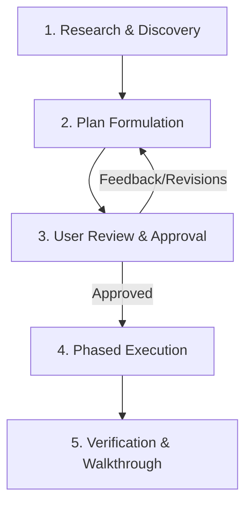

# Plan Mode

A structured protocol for exploring, architecting, and formulating technical plans before writing code or executing state-modifying actions.

## Core Philosophy

1. **Read-Only Exploration First**: In plan mode, investigate code, tests, documentation, and dependencies without modifying source code.
2. **Surfacing Tradeoffs & Assumptions**: Make architectural assumptions explicit. If multiple valid designs exist, outline them with pros and cons rather than picking silently.
3. **Formal Approval Gate**: Do not execute state-modifying steps until the complete plan has been presented and explicitly approved by the user.

---

## The Four-Phase Lifecycle

### Phase 1: Research & Discovery
- Trace existing call paths, service definitions, plugin seams, and event maps.
- Identify all affected files, consumers, unit tests, and configuration schemas.
- Do not run modifying commands or edit source code during this phase.

### Phase 2: Plan Formulation
Draft a detailed plan answering:
- **What**: Clear problem statement and desired end state.
- **Why**: Rationale and architectural fit.
- **Where**: Complete list of files to modify, create, or delete.
- **How**: Step-by-step changes ordered by dependency.
- **Validation**: Exact automated test commands and manual verification procedures.

### Phase 3: Review & Approval
- Present the plan clearly to the user.
- If running inside DeepSeek Harness with `@deepseek-ai/dsh-plan-mode`, call the `exit_plan_mode` tool with the markdown plan starting with a `#` heading.
- Wait for user feedback or approval before writing code.

### Phase 4: Phased Execution & Verification
- Execute one logical phase at a time.
- Verify tests/types after each phase.
- Document results in a final walkthrough.

---

## DeepSeek Harness (`dsh`) Native Integration

DeepSeek Harness includes native support for plan mode via `@deepseek-ai/dsh-plan-mode`:

| Command / Tool | Action |
|---|---|
| `/plan` | Enter plan mode (optionally `/plan <instruction>` to start with task context) |
| `/plan off` | Exit plan mode immediately |
| `exit_plan_mode` | Built-in tool called by the model to present the finished plan for review |

In Web and TUI interfaces, `exit_plan_mode` renders an interactive review dialog allowing the user to either:
- **Approve**: Exits plan mode and transitions to execution.
- **Keep Planning**: Sends feedback back to the agent to refine the plan.
