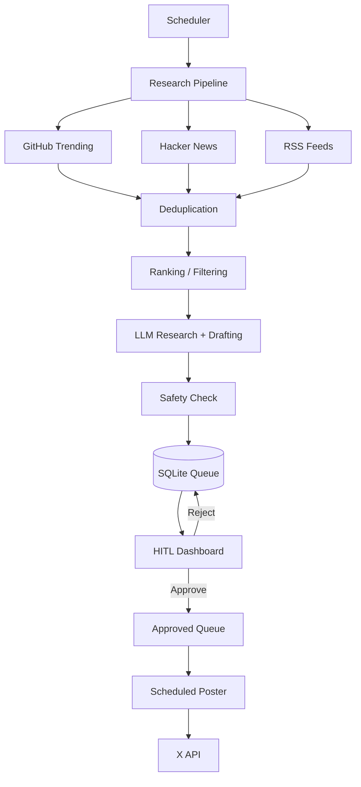

<p align="center">
  
  
  
  
  
</p>

<h1 align="center">🤖 X_Agent</h1>

<p align="center">
  <strong>An AI-powered content automation agent for discovering, researching, drafting, reviewing, and publishing AI/tech content.</strong>
</p>

<p align="center">
  Multi-source research → deduplication → LLM drafting → safety checks → human approval → scheduled publishing.
</p>

---

## 🎯 What Is X_Agent?

X_Agent is an autonomous content pipeline designed around **human-in-the-loop AI automation**.

Instead of blindly generating and posting content, it separates research, drafting, review, and publishing into explicit stages.

### Core pipeline

```
Sources
  ↓
Scrapers
  ↓
Deduplication
  ↓
Ranking / filtering
  ↓
LLM research + drafting
  ↓
Safety classification
  ↓
SQLite queue
  ↓
Human approval
  ↓
Scheduled publishing
```

## ✨ Key Features

- 🔎 **Multi-source research**
  - GitHub Trending
  - Hacker News
  - AI/ML RSS feeds
- 🧠 **LLM-powered drafting**
  - OpenAI
  - Google Gemini
  - NVIDIA
  - Hybrid researcher + writer mode
- ♻️ **Smart deduplication** using URLs and similar titles
- 👤 **Human-in-the-loop dashboard** before publishing
- 🛡️ **Safety classification** before approval
- ⏰ **Scheduled publishing** during configured windows
- 🗃️ **SQLite queue** for persistent draft state
- 📋 **Structured JSONL logs** for runs
- 🧩 Modular scraper, pipeline, model, queue, and poster components
- 🚦 Safe default: `POST_TO_X=false`

## 🏗️ Architecture



## 🧠 Design Principles

### 1. Automation with human control

The system does not require automatic publishing. Drafts can remain in the local queue until a human reviews them.

### 2. Provider flexibility

The LLM layer is configurable instead of locking the project to a single model provider.

### 3. Separation of concerns

Scraping, deduplication, drafting, safety checks, queue management, and publishing are independent components.

### 4. Safe-by-default publishing

`POST_TO_X=false` keeps the system in draft/review mode until publishing is explicitly enabled.

## 🛠️ Tech Stack

| Area | Technology |
|---|---|
| Language | Python |
| Scheduling | Python scheduler loop |
| Research | GitHub, Hacker News, RSS |
| LLMs | OpenAI, Gemini, NVIDIA |
| Storage | SQLite |
| Dashboard | Local web UI |
| Publishing | X API v2 |
| Authentication | OAuth 1.0a |
| Logging | JSONL |
| CI | GitHub Actions |

## 🚀 Quick Start

### Requirements

- Python 3.12+
- API credentials for your selected LLM provider
- X developer credentials only if publishing is enabled

### 1. Clone

```bash
git clone https://github.com/Prudhviraj101/X_Agent.git
cd X_Agent
```

### 2. Install

```bash
python -m pip install -r requirements.txt
```

### 3. Configure

```bash
cp .env.example .env
```

Set the model provider and credentials you want to use.

For safe local testing, keep:

```env
POST_TO_X=false
```

### 4. Run

```bash
python main.py
```

The agent starts its research pipeline and local review dashboard.

## ⚙️ Configuration

| Variable | Purpose |
|---|---|
| `MODEL_PROVIDER` | Select OpenAI, Gemini, NVIDIA, or hybrid |
| `OPENAI_API_KEY` | OpenAI credentials |
| `GEMINI_API_KEY` | Gemini credentials |
| `NVIDIA_API_KEY` | NVIDIA credentials |
| `X_API_KEY` | X consumer key |
| `X_API_SECRET` | X consumer secret |
| `X_ACCESS_TOKEN` | X access token |
| `X_ACCESS_SECRET` | X access secret |
| `POST_TO_X` | Enable/disable actual publishing |
| `SCRAPE_INTERVAL_HOURS` | Research cycle frequency |
| `MAX_POSTS_PER_RUN` | Maximum posts per cycle |
| `DEDUP_TTL_HOURS` | Duplicate retention window |
| `HTTP_TIMEOUT` | Request timeout |

Never commit `.env` or real API credentials.

## 📁 Project Structure

```
X_Agent/
├── main.py
├── config.py
├── scheduler.py
├── pipeline.py
├── deduplicator.py
├── drafter.py
├── poster.py
├── draft_queue.py
├── scraper/
│   ├── github_trending.py
│   ├── hackernews.py
│   └── rss_feeds.py
├── logs/
├── vendor/
├── .env.example
├── requirements.txt
└── .github/workflows/
    └── python.yml
```

## 🔐 Security Notes

- Keep all provider and X credentials in environment variables.
- Keep publishing disabled while testing the pipeline.
- Review generated content before enabling automated posting.
- Treat scraped content as untrusted input.
- Use least-privilege credentials where supported.

## 🧪 CI

GitHub Actions checks the Python project on pushes and pull requests targeting `main`.

The workflow installs dependencies, compiles Python sources, and validates the configuration template.

## 🗺️ Roadmap

- [ ] More research sources
- [ ] Better ranking and topic clustering
- [ ] Configurable approval rules
- [ ] Content analytics
- [ ] More robust provider adapters
- [ ] Containerized deployment
- [ ] Automated integration tests

## 📄 License

See the repository for the current licensing information.
